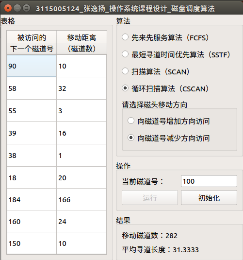

# OS_Des_Qt

「操作系统」课程设计：磁盘调度算法1（PC 版本）

Android 版本详见：[https://github.com/gdut-yy/OS_Des_Andrioid](https://github.com/gdut-yy/OS_Des_Andrioid)

## 0 操作系统课程设计任务书

### 0.1 主要内容

> 理解磁盘调度算法，并进一步加深对调度算法及其实现过程的理解。

### 0.2 任务要求

> 设计主界面以灵活选择某算法，且以下算法都要实现     
> 1、先来先服务算法（FCFS）      
> 2、最短寻道时间优先算法（SSTF）     
> 3、扫描算法（SCAN）     
> 4、循环扫描算法（CSCAN）    
> 并求出每种算法的平均寻道长度。

## 1 环境
    开发平台：

    PC端：Qt Creator 4.4.1(community) Qt版本5.9.2

    Linux：Ubuntu 16.04

    Windows：Windows 10

    Android端：Android Studio 2.3.3

    Android：7.1.2

    可跨平台运行（于Windows平台、Linux平台及Android平台下均测试通过）

## 2 算法

### 2.1 先到先服务算法（FCFS）

这是一种比较简单的磁盘调度算法。它根据进程请求访问磁盘的先后次序进行调度。此算法的优点是公平、简单，且每个进程的请求都能依次得到处理，不会出现某一进程的请求长期得不到满足的情况。此算法由于未对寻道进行优化，在对磁盘的访问请求比较多的情况下，此算法将降低设备服务的吞吐量，致使平均寻道时间可能较长，但各进程得到服务的响应时间的变化幅度较小。

### 2.2 最短寻道时间优先调度算法（SSTF）

该算法选择这样的进程，其要求访问的磁道与当前磁头所在的磁道距离最近，以使每次的寻道时间最短，该算法可以得到比较好的吞吐量，但却不能保证平均寻道时间最短。其缺点是对用户的服务请求的响应机会不是均等的，因而导致响应时间的变化幅度很大。在服务请求很多的情况下，对内外边缘磁道的请求将会无限期的被延迟，有些请求的响应时间将不可预期。 

### 2.3 扫描算法（SCAN）

扫描算法不仅考虑到欲访问的磁道与当前磁道的距离，更优先考虑的是磁头的当前移动方向。例如，当磁头正在自里向外移动时，扫描算法所选择的下一个访问对象应是其欲访问的磁道既在当前磁道之外，又是距离最近的。这样自里向外地访问，直到再无更外的磁道需要访问才将磁臂换向，自外向里移动。这时，同样也是每次选择这样的进程来调度，即其要访问的磁道，在当前磁道之内，从而避免了饥饿现象的出现。由于这种算法中磁头移动的规律颇似电梯的运行，故又称为电梯调度算法。此算法基本上克服了最短寻道时间优先算法的服务集中于中间磁道和响应时间变化比较大的缺点，而具有最短寻道时间优先算法的优点即吞吐量较大，平均响应时间较小，但由于是摆动式的扫描方法，两侧磁道被访问的频率仍低于中间磁道。

### 2.4 循环扫描（CSACN）

循环扫描算法是对扫描算法的改进。如果对磁道的访问请求是均匀分布的，当磁头到达磁盘的一端，并反向运动时落在磁头之后的访问请求相对较少。这是由于这些磁道刚被处理，而磁盘另一端的请求密度相当高，且这些访问请求等待的时间较长，为了解决这种情况，循环扫描算法规定磁头单向移动。例如，只自里向外移动，当磁头移到最外的被访问磁道时，磁头立即返回到最里的欲访磁道，即将最小磁道号紧接着最大磁道号构成循环，进行扫描。

## 3 运行结果

### 3.1 Linux：（运行于Ubuntu 16.04）

### 3.2 Windows：（运行于Windows 10）

### 3.3 测试数据1：（磁头位于磁道号范围内）
被访问的下一个磁道号：{55, 58, 39, 18, 90, 160, 150, 38, 184, }；

当前磁头号：100。

▲先来先服务算法

▲最短寻道时间优先调度算法

▲扫描算法（向磁道号增加的方向访问）

▲扫描算法（向磁道号减少的方向访问）

▲循环扫描算法（向磁道号增加的方向访问）

▲循环扫描算法（向磁道号减少的方向访问）

### 3.4 测试数据2：（磁头小于最小磁道号）
被访问的下一个磁道号：{55, 58, 39, 18, 90, 160, 150, 38, 184, }；

当前磁头号：0。

▲先来先服务算法

▲最短寻道时间优先调度算法

▲扫描算法（向磁道号增加的方向访问）

▲扫描算法（向磁道号减少的方向访问）

▲循环扫描算法（向磁道号增加的方向访问）

▲循环扫描算法（向磁道号减少的方向访问）

### 3.5 测试数据3：（磁头大于最大磁道号）
被访问的下一个磁道号：{55, 58, 39, 18, 90, 160, 150, 38, 184, }；

当前磁头号：200。

▲先来先服务算法

▲最短寻道时间优先调度算法

▲扫描算法（向磁道号增加的方向访问）

▲扫描算法（向磁道号减少的方向访问）

▲循环扫描算法（向磁道号增加的方向访问）

▲循环扫描算法（向磁道号减少的方向访问）